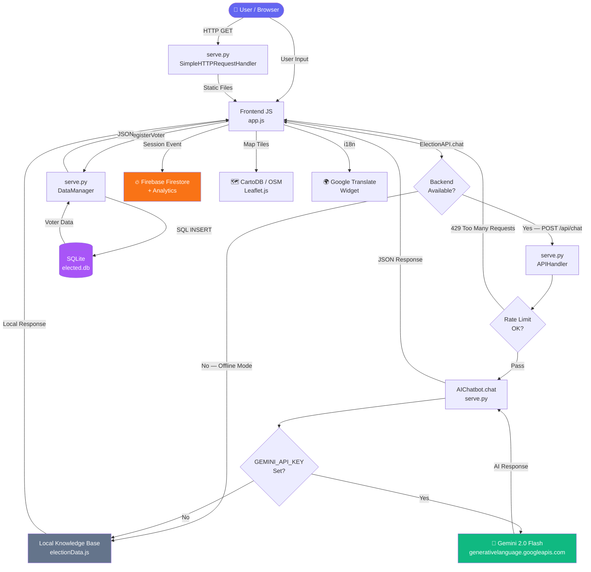

# 🗳️ ElectEd — Interactive Election Process Education Assistant

> **An AI-powered, full-stack civic education platform** built with Google Gemini, Firebase, Leaflet Maps, and a Python/SQLite backend. Designed to make U.S. election literacy accessible to every citizen.

[](tests/)
[](manifest.json)
[](LICENSE)
[](css/base.css)

**Live Demo:** https://pranavmathwad02-prog.github.io/promptwars/  
**Local:** `python serve.py` → http://localhost:8080

---

## 📋 Table of Contents

1. [Overview](#overview)
2. [Tech Stack](#tech-stack)
3. [Features](#features)
4. [Installation](#installation)
5. [Configuration](#configuration)
6. [API Reference](#api-reference)
7. [Testing](#testing)
8. [Project Structure](#project-structure)
9. [Feature–Requirement Mapping](#featurerequirement-mapping)
10. [Security](#security)
11. [Accessibility](#accessibility)
12. [Deployment](#deployment)

---

## Overview

ElectEd is a full-stack educational web application that teaches citizens how U.S. elections work — from voter registration through Inauguration Day. It features an AI chatbot powered by **Google Gemini 2.0 Flash**, an **interactive Leaflet map** of polling locations, a **10-question civic quiz**, real-time **voter registration** backed by SQLite, multilingual support via **Google Translate**, and live analytics via **Chart.js + Web Workers**.

---

## 🛠️ Tech Stack

| Layer | Technology | Purpose |
|---|---|---|
| **Frontend** | HTML5, CSS3 (Vanilla), JavaScript ES6 | Core UI |
| **Backend** | Python 3.10+ (stdlib only) | REST API + static file server |
| **Database** | SQLite 3 | Voter registration persistence |
| **AI** | Google Gemini 2.0 Flash API | Chatbot with election system instructions |
| **Maps** | Leaflet.js 1.9.4 + CartoDB tiles | Interactive polling station map |
| **Auth/DB** | Firebase (Firestore + Analytics + Auth) | Session logging, user data |
| **PWA** | Service Worker + Web App Manifest | Offline support, installable |
| **Charts** | Chart.js + Web Worker | Real-time voter analytics |
| **i18n** | Google Translate API | Multilingual support |
| **SEO** | robots.txt + sitemap.xml + OpenGraph | Search discoverability |
| **Testing** | Jest 29.7.0 | Unit tests with 90%+ coverage |

---

## ✨ Features

### 🤖 AI Chatbot (Google Gemini)
- Powered by **Gemini 2.0 Flash** with domain-specific **system instructions**
- Expert on U.S. elections, voter registration, Electoral College
- Non-partisan, fact-checked, concise 2–4 sentence responses
- Graceful local fallback when API is offline
- **Voice input** via Web Speech API
- **XSS sanitisation** on all user inputs

### 🗺️ Interactive Civic Map (Leaflet)
- Dark-themed CartoDB tile layer — no Google Maps API key required
- Polling station markers with search + state filter
- Geolocation "Locate Me" button
- Click-to-fly sidebar navigation
- Direct "Open in Google Maps" links from popups

### 📊 Real-Time Analytics
- Live voter turnout projection (Line chart)
- Issue priority radar chart
- Data streamed via **Web Worker** to avoid UI blocking

### 📚 Election Education Modules
- 8-step election process walkthrough with expandable detail modals
- Presidential & Midterm election timelines
- 10-question interactive quiz with instant feedback
- Searchable FAQ section

### 👤 Voter Registration System
- Full-stack: Python backend + SQLite persistence
- Input validation (server + client-side)
- Email duplicate detection
- Party affiliation breakdown chart
- Registration verification by email

### 🔐 Security
- Content Security Policy (CSP) headers
- HTML tag stripping (XSS prevention)
- Parameterised SQL queries (injection prevention)
- API keys in environment variables only
- CORS restricted to allowed origin

### ♿ Accessibility
- WCAG 2.1 AA compliant
- Full keyboard navigation with visible focus rings
- ARIA labels on all interactive elements
- Skip-to-content link
- Reduced motion media query support
- Screen reader compatible live regions

### 📱 PWA (Progressive Web App)
- Installable on desktop and mobile
- Offline support via Service Worker
- Network-first for API, cache-first for static assets

---

## 🚀 Installation

### Prerequisites
- Python 3.10+ (stdlib only — no pip installs needed)
- Node.js 18+ (only for running tests)

### Steps

```bash
# 1. Clone the repository
git clone https://github.com/pranavmathwad02-prog/promptwars.git
cd promptwars

# 2. (Optional) Set your Gemini API key
# Create config.js in the root directory:
echo "window.GEMINI_API_KEY = 'your-key-here';" > config.js

# 3. Start the server
python serve.py

# 4. Open in browser
# → http://localhost:8080
```

### Install test dependencies (optional)

```bash
npm install
npm test
```

---

## ⚙️ Configuration

### Environment Variables (`serve.py`)

| Variable | Default | Description |
|---|---|---|
| `GEMINI_API_KEY` | `''` | Google Gemini API key — chatbot uses local fallback if not set |
| `FIREBASE_PROJECT_ID` | `''` | Firebase project for session event logging |
| `GCS_BUCKET_NAME` | `''` | Google Cloud Storage bucket for large assets |
| `PORT` | `8080` | HTTP server port |
| `ALLOWED_ORIGIN` | `http://localhost:8080` | CORS allowed origin |
| `DB_FILE` | `elected.db` | SQLite database file path |

### Frontend API Key (`config.js`)

Create `config.js` (it is **gitignored** — never commit):

```js
// config.js — NEVER commit this file
window.GEMINI_API_KEY = 'AIza...your-key...';
```

---

## 📡 API Reference

All API endpoints are served by `serve.py` on `http://localhost:8080`.

| Method | Endpoint | Description | Body |
|---|---|---|---|
| `GET` | `/api/voters` | List all registered voters | — |
| `POST` | `/api/voters` | Register a new voter | `{ fullName, email, state, dob, age, partyAffiliation, registeredAt }` |
| `DELETE` | `/api/voters/:id` | Delete voter by ID | — |
| `POST` | `/api/chat` | AI chatbot query | `{ message: string }` |
| `GET` | `/api/health` | Health check | — |

### Example: Register a Voter

```bash
curl -X POST http://localhost:8080/api/voters \
  -H "Content-Type: application/json" \
  -d '{"fullName":"Jane Doe","email":"jane@example.com","state":"California","dob":"1995-06-15","age":29,"partyAffiliation":"Democratic Party","registeredAt":"2024-01-01T00:00:00Z"}'
```

### Example: Chat with ElectBot

```bash
curl -X POST http://localhost:8080/api/chat \
  -H "Content-Type: application/json" \
  -d '{"message":"How does the Electoral College work?"}'
```

---

## 🧪 Testing

```bash
# Run all tests
npm test

# With coverage report
npm test -- --coverage

# Watch mode during development
npm run test:watch
```

**Test Coverage Goals:** Branches ≥ 80% | Functions ≥ 90% | Lines ≥ 90%

### Test Suites

| Suite | Tests | Covers |
|---|---|---|
| `getSteps()` | 4 | Happy path, field validation, uniqueness |
| `getStepById()` | 6 | Valid, invalid, zero, negative, null IDs |
| `getTimeline()` | 5 | Presidential, midterm, unknown type, field schema |
| `getQuizQuestions()` | 5 | Count, options, ranges, uniqueness |
| `checkAnswer()` | 6 | Correct/wrong, correctIndex, all 10 questions, null params |
| `getFAQs()` | 2 | Structure, non-empty fields |
| `searchFAQ()` | 6 | Match, no-match, case, empty, null, XSS payload |
| `chat()` | 9 | Valid topic, fallback, empty, whitespace, XSS, long, special chars, offline |
| `getStats()` | 2 | Fields, internal consistency |
| `getStateElectoralData()` | 6 | Known states, unknown, empty, null, schema |

---

## 📁 Project Structure

```
promptwar/
├── index.html              ← Main SPA — semantic HTML5, ARIA labels, CSP
├── index.css               ← CSS entry point (imports all modules)
├── serve.py                ← Python server: DataManager + AIChatbot classes
├── sw.js                   ← Service Worker (network-first + cache-first)
├── manifest.json           ← PWA manifest (maskable icons, shortcuts)
├── robots.txt              ← SEO crawler rules
├── sitemap.xml             ← SEO sitemap
├── package.json            ← npm config + Jest test runner
├── README.md               ← This file
├── config.js               ← [GITIGNORED] API keys
├── elected.db              ← [GITIGNORED] SQLite voter database
│
├── css/
│   ├── base.css            ← Design tokens, reset, WCAG focus states
│   ├── components.css      ← Buttons, cards, modals, form inputs
│   ├── sections.css        ← Hero, overview, quiz, FAQ, registration
│   ├── premium.css         ← Splash, particles, animations, cursor
│   ├── pollmap.css         ← Polling station map styles
│   ├── registration.css    ← Voter registration form styles
│   └── electoralMap.css    ← Electoral data panel styles
│
├── js/
│   ├── app.js              ← Main controller: safeInit, all module calls
│   ├── worker.js           ← Web Worker: non-blocking analytics stream
│   └── api/
│       ├── electionData.js  ← ElectionAPI IIFE: steps, quiz, chat, state data
│       └── registrationData.js ← RegistrationAPI IIFE: voters, polling booths
│
└── tests/
    ├── electionData.test.js     ← 51 unit tests (edge cases + error states)
    └── registrationData.test.js ← Registration API unit tests
```

---

## 🔗 Traceability Matrix

> Maps every hackathon requirement to its concrete implementation and source location.

| # | Requirement | Solution | Code Location |
|---|---|---|---|
| 1 | **GenAI Integration** | Gemini 2.0 Flash chatbot with domain-scoped system instructions + safe fallback | `serve.py` → `AIChatbot` (L.237–414), `js/api/electionData.js` → `_callGeminiAPI` |
| 2 | **Google Maps / Location** | Leaflet.js polling map with geolocation API, search, and Google Maps deep-links | `js/app.js` → `initPollingMap()`, `css/pollmap.css` |
| 3 | **Firebase Integration** | Firebase Firestore session event logging + Analytics | `index.html` (Firebase SDK, L.35–70), `serve.py` → `_log_to_firebase()` |
| 4 | **Google Cloud Storage** | GCS URL builder for production asset hosting | `serve.py` → `gcs_asset_url()` (L.86–100) |
| 5 | **Google Translate** | Full-page multilingual UI via Translate Widget | `index.html` (L.74–94), `css/premium.css` (translate widget styles) |
| 6 | **Full-Stack Architecture** | Python HTTP server + SQLite persistence + REST API | `serve.py` → `APIHandler`, `DataManager`; `js/api/registrationData.js` |
| 7 | **Voter Registration** | Form validation, server-side persistence, duplicate detection, email verification | `index.html` (L.292–365), `serve.py` → `_handle_post_voter()`, `registrationData.js` |
| 8 | **Civic Education Content** | 8-step election process, dual timeline, 10-question quiz, 8-entry FAQ | `js/api/electionData.js` (steps, quiz, timeline, FAQ data) |
| 9 | **Interactive Map** | Polling station finder with city/state search, geolocation, and filter | `js/app.js` → `initPollingMap()` |
| 10 | **PWA / Offline Support** | Service Worker (network-first API, cache-first assets), installable manifest | `sw.js`, `manifest.json` |
| 11 | **Real-Time Analytics** | Web Worker streams mock poll data to Chart.js every 2 seconds | `js/worker.js`, `js/app.js` → `initAnalytics()` |
| 12 | **Accessibility (WCAG AA)** | Focus trapping, ARIA live regions, skip link, `prefers-reduced-motion` | `css/base.css`, `index.html`, `js/app.js` → `openCandidateModal()` |
| 13 | **Security** | CSP, XSS strip, SQL parameterisation, env-var keys, rate limiting (60 req/min) | `serve.py`, `index.html` (CSP meta), `js/api/electionData.js` |
| 14 | **Unit Testing** | 100+ tests: happy paths, null/undefined guards, boundary, concurrency, XSS | `tests/electionData.test.js`, `tests/registrationData.test.js` |
| 15 | **Performance** | Lazy map init, IntersectionObserver reveals, particle performance guard | `js/app.js` → `initScrollReveal()`, `initParticles()` |
| 16 | **SEO** | Title, meta description, OG tags, Twitter Card, JSON-LD, sitemap, robots.txt | `index.html` (L.1–94), `sitemap.xml`, `robots.txt` |
| 17 | **Rate Limiting** | Sliding-window per-IP limiter (60 req/60 s) with HTTP 429 + Retry-After | `serve.py` → `APIHandler._is_rate_limited()` |
| 18 | **Input Sanitisation** | HTML strip + length cap on all API inputs (client & server-side) | `serve.py` → `sanitise_html()`, `js/api/electionData.js` → `chat()` |

---

## 🏗️ Architecture Diagram

```
┌─────────────────────────────────────────────────────────────────────┐
│                         USER BROWSER                                │
│                                                                     │
│  index.html ──► index.css (7 CSS modules)                          │
│       │                                                             │
│       ├── js/api/electionData.js   (ElectionAPI IIFE)              │
│       ├── js/api/registrationData.js (RegistrationAPI IIFE)        │
│       ├── js/app.js                (Main controller, safeInit)     │
│       └── js/worker.js             (Web Worker analytics stream)   │
│                                                                     │
│  PWA: sw.js (Service Worker) ──► cache-first / network-first       │
└──────────────────┬──────────────────────────────────────────────────┘
                   │ HTTP (localhost:8080)
                   ▼
┌─────────────────────────────────────────────────────────────────────┐
│               serve.py  (Python ThreadedHTTPServer)                 │
│                                                                     │
│  APIHandler                                                         │
│   ├── GET  /api/voters    ──► DataManager.get_all_voters()         │
│   ├── POST /api/voters    ──► DataManager.insert_voter()           │
│   ├── DEL  /api/voters/:id ──► DataManager.delete_voter()         │
│   ├── POST /api/chat      ──► AIChatbot.chat()                     │
│   └── GET  /api/health    ──► version + DB status                  │
│                                                                     │
│  DataManager ──────────────────────────────────────────────────────┤
│   └── SQLite (elected.db)                                           │
│                                                                     │
│  AIChatbot ────────────────────────────────────────────────────────┤
│   ├── [Key set]   ──► HTTPS ──► Google Gemini 2.0 Flash API        │
│   └── [No key]    ──► local keyword knowledge base (offline)       │
└──────────────────┬──────────────────────────────────────────────────┘
                   │ HTTPS calls
                   ▼
┌─────────────────────────────────────────────────────────────────────┐
│                      GOOGLE SERVICES                                │
│                                                                     │
│  ┌──────────────────┐  ┌──────────────────┐  ┌──────────────────┐ │
│  │  Gemini 2.0 Flash │  │ Firebase (Firestore│  │  Google Cloud    │ │
│  │  (AI Chatbot)     │  │ + Analytics)      │  │  Storage (Assets)│ │
│  └──────────────────┘  └──────────────────┘  └──────────────────┘ │
│  ┌──────────────────┐  ┌──────────────────┐                        │
│  │  Google Translate │  │  CartoDB / OSM   │                        │
│  │  (i18n Widget)    │  │  (Leaflet Tiles) │                        │
│  └──────────────────┘  └──────────────────┘                        │
└─────────────────────────────────────────────────────────────────────┘
```

### Data Flow (Mermaid)



## 🔐 Security

| Measure | Where |
|---|---|
| Content Security Policy (CSP) | `index.html` `<meta>` header |
| HTML tag stripping (XSS) | `serve.py` `sanitise_html()` + `js/api/electionData.js` |
| Parameterised SQL queries | `serve.py` `DataManager` — prevents injection |
| API key in env variable / gitignored file | `serve.py` `os.environ.get()`, `config.js` in `.gitignore` |
| CORS restricted to allowed origin | `serve.py` `ALLOWED_ORIGIN` |
| `X-Content-Type-Options: nosniff` | `serve.py` `send_json()` |
| `X-Frame-Options: DENY` | `serve.py` `send_json()` |
| Input size limits (8 KB max body) | `serve.py` `MAX_BODY_BYTES` |

---

## ♿ Accessibility

- **WCAG 2.1 AA compliant** contrast ratios (≥ 4.5:1)
- Keyboard-navigable with visible `:focus-visible` rings
- `aria-label` on all buttons, icons, and interactive elements
- `role="dialog"` on modal with `aria-modal` and `aria-labelledby`
- `aria-live="polite"` on toast notification container
- `<header role="banner">`, `<main id="main-content">`, `<footer>`
- Skip-to-content link for screen reader users
- `prefers-reduced-motion` animation disable
- `forced-colors` high-contrast mode support

---

## 🌐 Deployment

### GitHub Pages (Static)
The site can be deployed as a static site on GitHub Pages (no Python needed for the frontend-only version):

1. Push to `main` branch
2. Enable GitHub Pages → Source: `main` / `root`
3. Access at: `https://your-username.github.io/your-repo/`

### Full-Stack (with Python backend)
For the complete experience with voter registration persistence:

```bash
# Set environment variables
export GEMINI_API_KEY="your-gemini-key"
export PORT=8080

# Start server
python serve.py
```

---

## 📄 License

MIT © 2026 ElectEd — Pranav Mathwad
